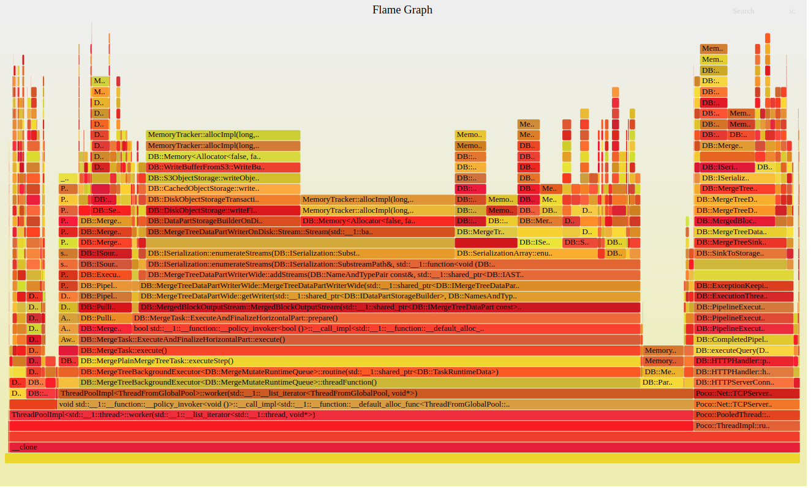

# Visualize stack traces with flamegraphs

Flamegraphs are a great way to visualize metrics from stack traces, helping you see what contributed to spikes in resource usage, so you can identify memory leaks or areas for optimization.

You can configure ClickHouse to store the ClickHouse Server's stack traces in a table, allowing you to query it with SQL and generate a flamegraph visualisation with the [Flamegraph visualiser](https://github.com/brendangregg/FlameGraph).

Of course, you can also ingest your own application's stack traces, and visualise these in the same way, too.

To work with ClickHouse's internal stack traces, you need to enable the `system.trace_log` table.

## ClickHouse Server Configs
First, enable the `system.trace_log` table.

```xml
...
<trace_log>
    <database>system</database>
    <table>trace_log</table>
    <partition_by>toYYYYMM(event_date)</partition_by>
    <flush_interval_milliseconds>7500</flush_interval_milliseconds>
</trace_log>
...
```

Next, configure the Sampling Query Profiler

```xml
...
<total_memory_profiler_step>4194304</total_memory_profiler_step>    
<total_memory_profiler_sample_probability>0</total_memory_profiler_sample_probability>
...
```

Finally, set up the query profiler settings and allow introspection functions

```xml
...
<profiles>
    <default>
        ...
        <log_queries>1</log_queries>
        <allow_introspection_functions>1</allow_introspection_functions>
        <query_profiler_cpu_time_period_ns>40000000</query_profiler_cpu_time_period_ns>
        <query_profiler_real_time_period_ns>40000000</query_profiler_real_time_period_ns>
        ...
    </default>
</profiles>
```
## Generate the Flamegraph

By using the ClickHouse introspection functions, you can parse the information from the `system.trace_log` to generate a flamegraph. This is the query you can use:

```sql
SELECT
    arrayStringConcat(arrayMap(x -> demangle(addressToSymbol(x)), trace), ';') AS full_trace,
    count() AS samples
FROM system.trace_log
WHERE event_time >= now() - INTERVAL 5 MINUTE
GROUP BY full_trace 
```

Download the [Flamegraph visualiser](https://github.com/brendangregg/FlameGraph).

You can use the CLI to run the query and pipe the output to the `flamegraph.pl` script:

```bash
    ./clickhouse client -q "SELECT arrayStringConcat(arrayReverse(arrayMap(x -> demangle(addressToSymbol(x)), trace)), ';') AS full_trace, count() AS samples FROM system.trace_log WHERE event_time >= now() - INTERVAL 5 MINUTE GROUP BY full_trace FORMAT TabSeparated" | ./flamegraph.pl > flamegraph.svg
```

Now you can see your flamegraph:

